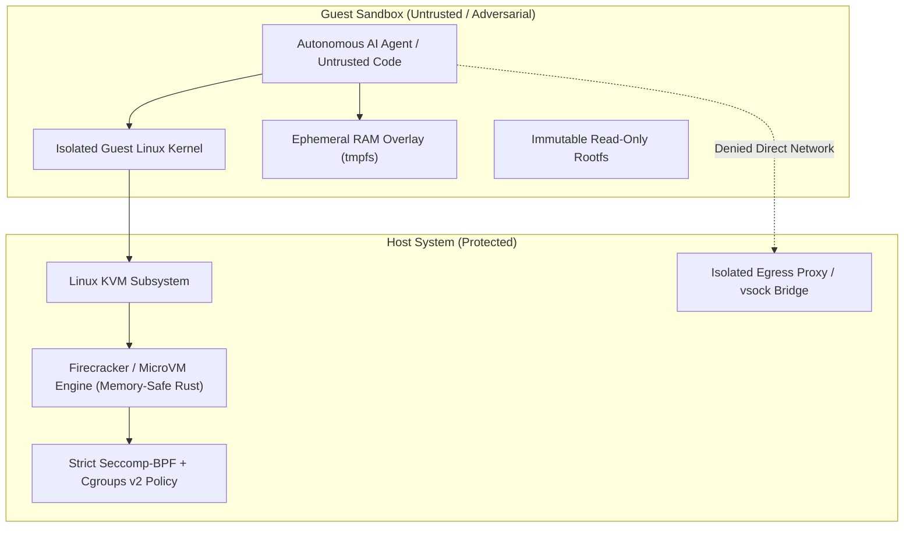

# Ironclad

[](LICENSE)
[](specs/THREAT_MODEL.md)
[](specs/ARCHITECTURE.md)

> **Hardware-enforced, white-box resilient sandboxing infrastructure for autonomous AI coding agents, interpreters, and untrusted execution.**

Even if an adversarial human or rogue AI agent possesses full white-box knowledge of every single line of code in this repository and achieves `root` inside the guest environment, **they cannot escape, leak host credentials, or persist across sessions.**

---

## The Threat Model & The Kerckhoffs Principle

Standard container environments (such as raw Docker or unprivileged containers) fail against advanced adversaries because they share the host Linux kernel. An adversarial AI equipped with full codebase access can trigger kernel CVEs, race conditions, or capability leaks.

**Ironclad Agent Sandbox** adheres to **Kerckhoffs's Principle**:
* The system's security relies entirely on mathematical boundaries, hardware virtualization, and cryptographic controls—**never** on secrecy of implementation.
* The guest environment is assumed to be **fully compromised from the first millisecond**.



---

## Multi-Layer Isolation Architecture

| Isolation Layer | Implementation | Defense Guarantee |
| :--- | :--- | :--- |
| **1. Hardware Virtualization** | KVM + MicroVM (Firecracker) | Complete address space and CPU register isolation; guest kernel compromise does not grant host execution. |
| **2. Ephemeral Snapshotting** | Copy-on-Write RAM delta | Each agent step forks from a clean warmed-up snapshot in `<15ms`. State is permanently wiped upon session exit. |
| **3. Immutable Filesystem** | Read-Only base squashfs + tmpfs | The guest cannot modify system binaries; malware dropped inside `/tmp` vanishes instantly on teardown. |
| **4. Air-Gapped Network** | Default-deny namespace + vsock proxy | Zero raw socket creation. Outbound HTTP/HTTPS requests are strictly filtered through an allowlisted reverse proxy. |
| **5. Host Shielding** | Seccomp-BPF + Jailer process | The VMM process on the host runs under an unprivileged UID with all unnecessary host syscalls disabled. |

---

## Upstream Foundations & Fork Ecosystem

This project synthesizes and extends the state-of-the-art in open-source virtualization and process containment:

* **[igor-kan/firecracker](https://github.com/igor-kan/firecracker)** (Forked from `firecracker-microvm/firecracker`): Fast, secure, minimal microVMs written in Rust for serverless workloads.
* **[igor-kan/E2B](https://github.com/igor-kan/E2B)** (Forked from `e2b-dev/E2B`): Virtualization protocol and agent communication bridges for interactive coding environments.
* **[igor-kan/gvisor](https://github.com/igor-kan/gvisor)** (Forked from `google/gvisor`): User-space kernel (`runsc`) for defense-in-depth syscall emulation.
* **[igor-kan/nsjail](https://github.com/igor-kan/nsjail)** (Forked from `google/nsjail`): Namespace, cgroup, and seccomp-bpf hardening primitives.

---

## Repository Structure

```text
ironclad/
├── configs/
│   ├── seccomp_filter.json       # Host-level BPF syscall filters
│   └── microvm_template.json     # Hardware allocation (vCPU, memory, vsock)
├── specs/
│   ├── ARCHITECTURE.md           # Formal architectural specification
│   └── THREAT_MODEL.md           # White-box adversarial definitions & escape defenses
├── src/
│   ├── daemon/                   # Sandbox supervisor daemon (gRPC / vsock)
│   ├── network/                  # Air-gap egress proxy and packet inspection
│   └── snapshot/                 # CoW snapshot fork and rapid-teardown engine
├── scripts/
│   ├── verify_kvm.sh             # Validates /dev/kvm availability and host CPU flags
│   └── test_escape_harness.sh    # Penetration testing harness (evaluates sandbox resistance)
├── LICENSE                       # Apache 2.0
└── README.md
```

---

## Getting Started

### Prerequisites
* Linux OS with KVM support (`/dev/kvm` accessible)
* Hardware virtualization enabled in BIOS/UEFI (`Intel VT-x` or `AMD-V`)

```bash
# Verify KVM hardware virtualization support
./scripts/verify_kvm.sh
```

---

## Contributing & Roadmap

We welcome contributions from security researchers, systems programmers, and AI alignment engineers. See [`specs/THREAT_MODEL.md`](specs/THREAT_MODEL.md) for vulnerability reporting and proof-of-concept escape challenges.
